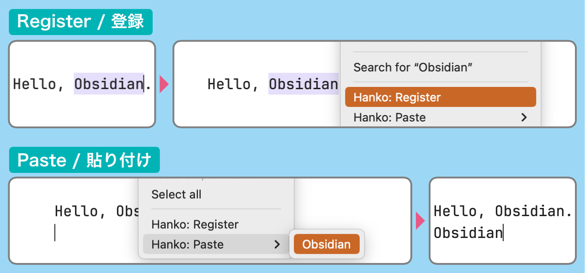
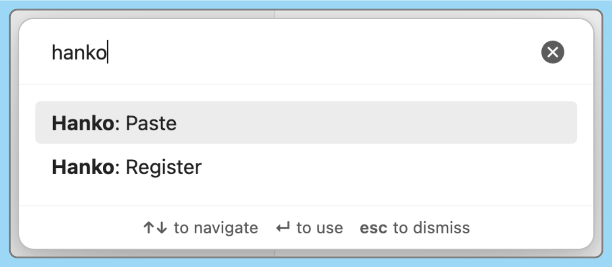
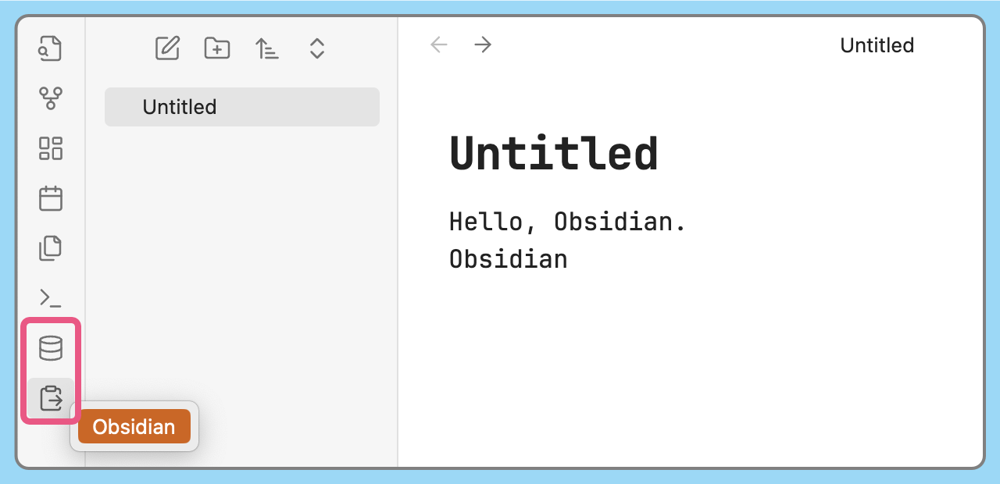
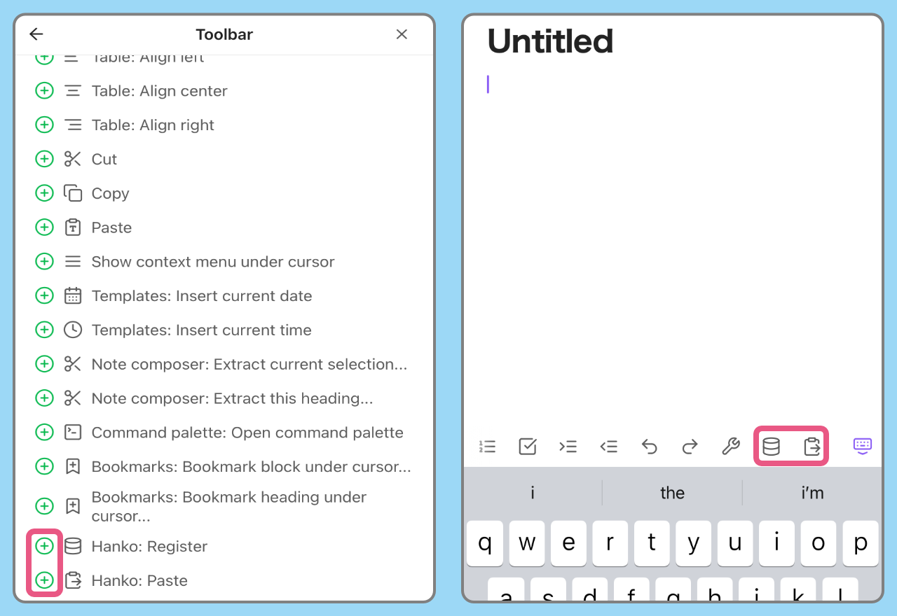
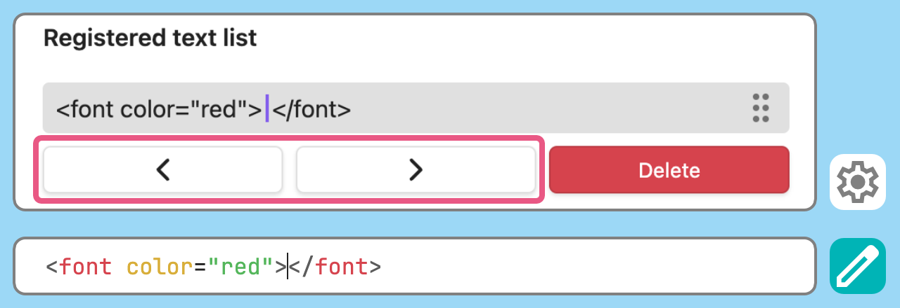
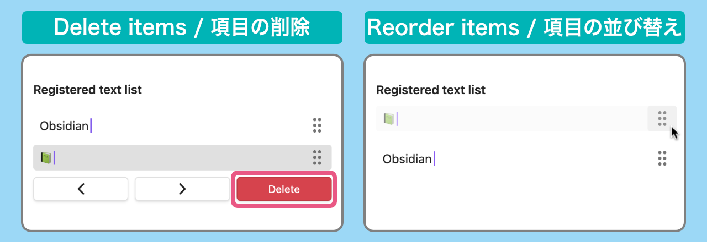

# Hanko

## Features / 機能概要

This plugin adds the following features to Obsidian.

このプラグインはObsidianに以下の機能を追加します

- Register and paste any text.

- 任意のテキストを登録し貼り付ける

## Installation / インストール方法

Obsidian Settings > Community plugins > Browse > Type 'hanko' into the search box > Select the 'Hanko' card > Install > Enable

Obsidianの設定 > コミュニティプラグイン > 閲覧 > 検索ボックスに「hanko」と入力 > 「Hanko」のカードを選択 > インストール > 有効化

## Usage / 使い方

### Register and paste any text / 任意のテキストの登録と貼り付け

- Register: Select text in Edit mode > Right-click menu > Register
- Paste: Right-click menu > Paste > Select text to paste

- 登録：編集モードでテキストを選択 > 右クリックメニュー > 登録
- 貼り付け：右クリックメニュー > 貼り付け > 貼り付けたいテキストを選択

You can also be operated from the command palette.  
Type “hanko” in the search box.

コマンドパレットからも操作できます  
検索ボックスに「hanko」と入力します

You can also be operated from the Ribbon menu.

リボンメニューからも操作できます

On mobile devices, you can add commands to the toolbar to use them.

モバイルではツールバーにコマンドを追加して使用します

- Obsidian Settings > Toolbar

- Obsidianの設定 > モバイルツールバー

> [!WARNING]  
> This plugin works in edit mode.  
> Doesn't work in preview mode.
>
> このプラグインは編集モードで動作します  
> プレビューモードでは動作しません

### Paste with cursor movement / カーソル移動を伴う貼り付け

Set the cursor position after pasting from the plugin settings.

プラグインの設定から貼り付け後のカーソル位置を指定します

> [!WARNING]  
> It doesn't work on mobile because the software keyboard is closed when the paste menu is opened.
>
> モバイルでは貼り付けメニューが開く際にソフトウェアキーボードが閉じられるため機能しません

### Manage registered items / 登録した項目の管理

You can delete and reorder items from the plugin settings.

プラグインの設定から項目の削除と並び替えができます

