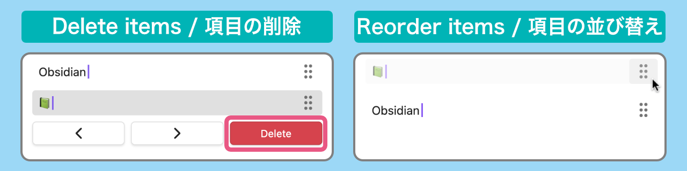

# About Plugin / プラグインについて

Add the function to register and paste any text to Obsidian.

<!-- prettier-ignore -->
任意のテキストを登録し貼り付ける機能をObsidianに追加します

# How to use / 使用方法

## Register and paste any text / 任意のテキストの登録と貼り付け

### Right-click menu / 右クリックメニュー

-   Register: Select text in Edit mode > Right-click menu > Register
-   Paste: Right-click menu > Paste > Select text to paste

-   登録：編集モードでテキストを選択 > 右クリックメニュー > 登録
-   貼り付け：右クリックメニュー > 貼り付け > 貼り付けたいテキストを選択

> [!WARNING]  
> This plugin works in edit mode.  
> Doesn't work in preview mode.
>
> このプラグインは編集モードで動作します  
> プレビューモードでは動作しません

### Command / コマンド

You can also be operated from the command palette.  
Type “hanko” in the search box.

コマンドパレットからも操作できます  
検索ボックスに「hanko」と入力します

### Ribbon menu / リボンメニュー

You can also be operated from the Ribbon menu.

リボンメニューからも操作できます

### Mobile / モバイル

Add commands from “Settings” > “Toolbar” in Obsidian.

<!-- prettier-ignore -->
Obsidianの「設定」 > 「モバイルツールバー」からコマンドを追加します

## Paste with cursor movement / カーソル移動を伴う貼り付け

Set the cursor position after pasting from the plugin settings.

プラグインの設定から貼り付け後のカーソル位置を指定します

> [!WARNING]  
> It doesn't work on mobile because the software keyboard is closed when the paste menu is opened.
>
> モバイルでは貼り付けメニューが開く際にソフトウェアキーボードが閉じられるため機能しません

## Manage registered items / 登録した項目の管理

You can delete and reorder items from the plugin settings.

プラグインの設定から項目の削除と並び替えができます

